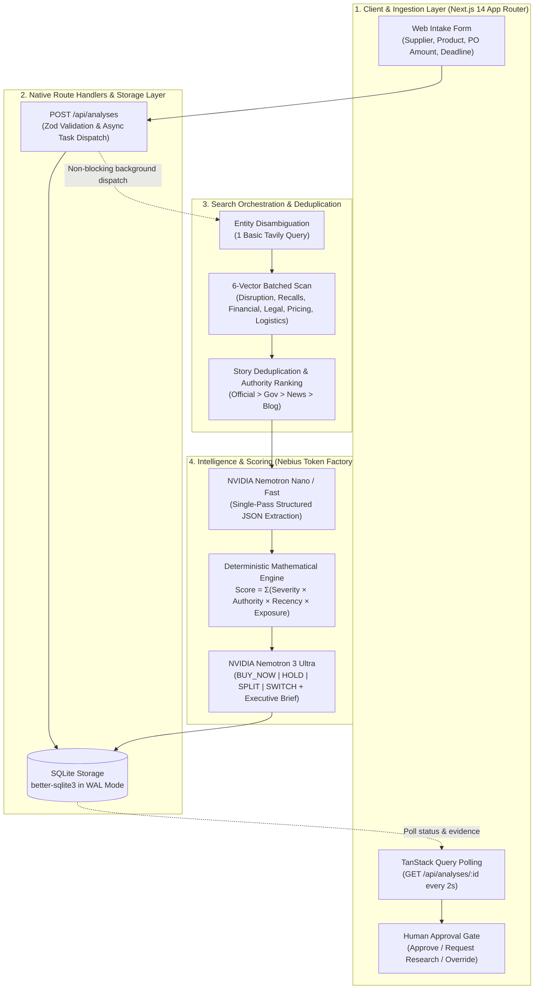

# ProofPulse ⚡

> **Autonomous Real-Time Supply Chain Risk & Procurement Agent**  
> Built for the **Nebius x NVIDIA Global AI Hackathon (Track: Best Apps & Agents)**

ProofPulse protects procurement teams from catastrophic supply chain disruptions. Instead of relying on manual quarterly vendor reviews or hallucination-prone black-box LLM predictions, ProofPulse combines targeted web intelligence via Tavily with a deterministic mathematical scoring formula and NVIDIA Nemotron reasoning on Nebius Token Factory.

---

## 🌟 Key Capabilities

* **Targeted 6-Vector Search Scan:** Executes batched searches across operational disruptions, recalls, financial warnings, legal sanctions, pricing trends, and freight logistics.
* **Deterministic Risk Scoring:** Eliminates LLM drift with an auditable mathematical calculation:
  $$\text{Score} = \sum (\text{Severity} \times \text{Reliability} \times \text{Recency} \times \text{Exposure})$$
* **Two-Tier Nemotron Intelligence:**
  * **Nemotron Fast / Nano:** Single-pass structured fact extraction from search citations.
  * **Nemotron Ultra:** Strategic synthesis delivering actionable procurement directives (`BUY_NOW`, `HOLD`, `SPLIT`, `SWITCH`).
* **Human Approval Gate:** Ensures high-value purchase orders are never automatically altered without an auditable human sign-off.

---
ProofPulse operates as an asynchronous, single-runtime agent built on the Next.js 14 App Router with SQLite in Write-Ahead Logging (WAL) mode. When a user submits an order via the intake form, the POST /api/analyses route validates the payload with Zod, inserts a job record into SQLite, and immediately returns an analysis ID so the frontend can poll progress without request timeouts. In the background, an in-process orchestrator resolves the supplier entity, runs 6 targeted Tavily queries in concurrent batches of three, and deduplicates the search results by headline and domain authority. These clean snippets are passed to NVIDIA Nemotron Fast on Nebius Token Factory for single-pass structured JSON fact extraction. A pure TypeScript deterministic mathematical formula calculates a 0–100 risk score and category breakdown, after which Nemotron Ultra performs a single strategic synthesis to generate procurement directives (BUY_NOW, HOLD, SPLIT, SWITCH) and an executive brief. Finally, the completed analysis updates SQLite and renders on the dashboard behind an auditable Human Approval Gate.


---
## ⚡ Powered by Nebius Token Factory & NVIDIA Nemotron

ProofPulse uses an enterprise-grade AI architecture powered by Nebius and NVIDIA:

* **Nebius Token Factory:** Serverless OpenAI-compatible inference endpoint (`https://api.studio.nebius.ai/v1`) providing sub-second latency for real-time risk assessment.
* **NVIDIA Nemotron Nano / Fast:** Lightweight, high-throughput model responsible for single-pass structured fact extraction from unformatted web intelligence.
* **NVIDIA Nemotron Ultra:** High-reasoning foundation model tasked with procurement trade-off analysis, executive directives, and synthesis briefs.
* **Source Code Verification:** See `src/services/nemotron.ts` for the production client configuration.

## 🚀 Getting Started

### 1. Prerequisites
* Node.js v18+ or v20+ LTS
* npm v9+
* Nebius Token Factory API Key
* Tavily API Key

### 2. Installation
```bash
# Clone the repository
git clone [https://github.com/kbytehub0x/proofpulse.git]
cd proofpulse

# Install dependencies
npm install
